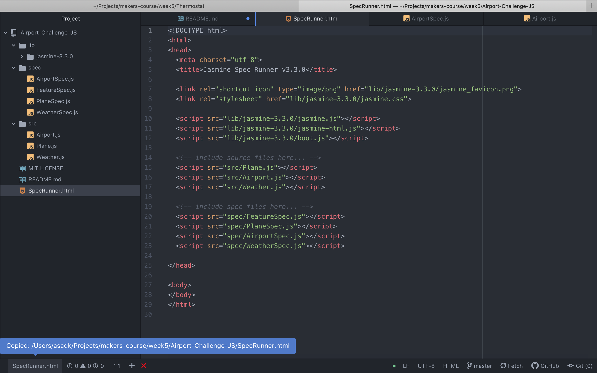
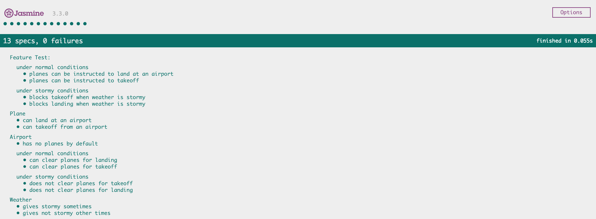

# Airport-Challenge-JS

The purpose of this repository was to learn how to complete the airport challenge within javascript in an attempt to learn the fundamentals in the line with the excellent testing framework, jasmine.

## What is the airport challenge?

It is a task designed by makers to help learn many fundamental concepts in programming such as mocks and stubs for testing, dependency injection and how to follow a clear TDD process.

## Running the tests

To run the tests, you will need to copy and paste the route of the SpecRunner.html file into a web browser.

See the screenshots as below.

